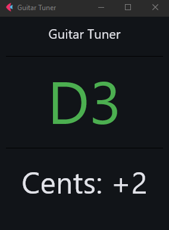

# Guitar Tuner



## Setup

```
// clone the repository and cd inside
python -m venv .
pip install flet==0.85.3 flet-audio-recorder==0.85.3 flet-cli==0.85.3 flet-desktop==0.85.3 flet-web==0.85.3
```

## Running the app

```bash
flet run
```

## Building the app (Android)

```bash
flet build apk -v
```

- Generated APKs are in ./build/apk/
- Most modern Android phones use the arm64-v8a apk